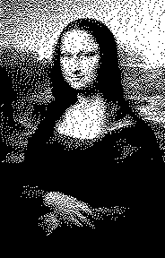

# mcd_formatter
Converts a monochrome image into a c byte array (and back again).

Written for the [SSD1306](https://www.adafruit.com/product/326) monochrome OLED display in horizontal scanning mode, although this should work (or be easily adaptable) for other 1-bit displays.

## Usage
Type `python mcdformatter.py --help` for usage information.
```
$ python mcdformatter.py --help
Usage: mcdformatter.py [OPTIONS]

Options:
  --input_filename PATH      File from which the image or array definition
                             will be read.

  -p, --pack / -u, --unpack  Whether you want to pack an image into an array
                             definition, or unpack an image from an array
                             definition.

  -w, --width INTEGER        The width of the output image when unpacking from
                             array definition. Default 128.

  --help                     Show this message and exit.
```

## Examples
The utility is built to be reversible for the purpose of sanity-checking your output.
### Packing
```
$ python mcdformatter.py -p --input_filename=examples/mona.bmp
```
Outputs a text file in the same directory as the input file (with the same basename but with a .txt extension). The contents of the text file will be a const c-array definition:
```c
static const uint8_t mona[6624] = {
	0xAD, 0x56, 0x52, 0x49, 0x94, 0x31, 0x44, 0xCA, 0x56, 0x64, 0xD1, 0xC9, 0x12, 0x56, 0xA9, 0x25,
	0xD2, 0x15, 0xAA, 0x98, 0x53, 0x25, 0x32, 0x69, 0x6A, 0x95, 0xAA, 0xA9, 0x32, 0x2D, 0x69, 0x99,
	0xBA, 0xE5, 0x66, 0x65, 0xA5, 0xAB, 0xAA, 0x66, 0xAD, 0x29, 0xEA, 0xED, 0xA6, 0x65, 0xAE, 0x9A,
	0xAB, 0x55, 0x1C, 0xF5, 0xC6, 0x55, 0xAA, 0xA6, 0x56, 0x79, 0xCD, 0xAA, 0xB6, 0xE4, 0x53, 0xBD,
	0x97, 0x59, 0xB5, 0x7B, 0x6B, 0xD6, 0xAA, 0xFD, 0xCE, 0xF7, 0xB5, 0x6F, 0xEA, 0x3E, 0xB7, 0xAE,
	0xEB, 0x6A, 0xF5, 0xDE, 0xEB, 0xCB, 0xB5, 0xBB, 0x6D, 0x7B, 0xEA, 0xAF, 0x5A, 0xED, 0xBF, 0xB5,
  /* --- */
	0x00, 0x00, 0x00, 0x00, 0x00, 0x00, 0x00, 0x00, 0x00, 0x00, 0x00, 0x00, 0x00, 0x00, 0x00, 0x00,
	0x00, 0x00, 0x00, 0x00, 0x00, 0x00, 0x00, 0x00, 0x00, 0x00, 0x00, 0x00, 0x00, 0x00, 0x00, 0x00,
	0x00, 0x00, 0x00, 0x00, 0x00, 0x00, 0x00, 0x00, 0x00, 0x00, 0x00, 0x00, 0x00, 0x00, 0x00, 0x00,
	0x00, 0x00, 0x00, 0x00, 0x00, 0x00, 0x00, 0x00, 0x00, 0x00, 0x00, 0x00, 0x00, 0x00, 0x00, 0x00,
	0x00, 0x00, 0x00, 0x00, 0x00, 0x00, 0x00, 0x00, 0x00, 0x00, 0x00, 0x00, 0x00, 0x00, 0x00, 0x00,
	0x00, 0x00, 0x00, 0x00, 0x00, 0x00, 0x00, 0x00, 0x00, 0x00, 0x00, 0x00, 0x00, 0x00, 0x00, 0x00
};

```
### Unpacking
```
$ python mcdformatter.py -u --input_filename=examples/mona.txt --width=184
```
Outputs the following image in the same directory as the input file (with the same basename but with a .bmp extension):


